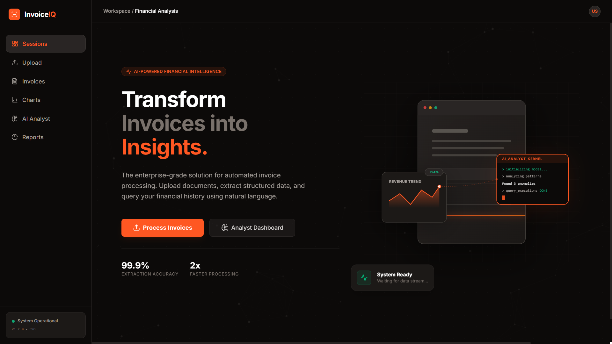
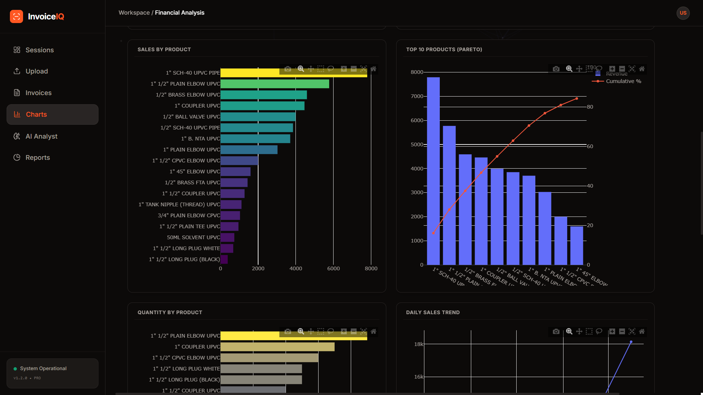
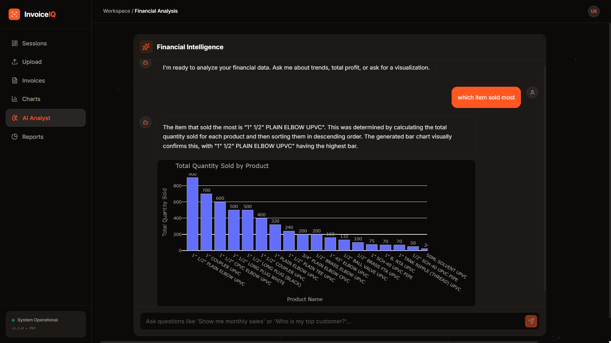
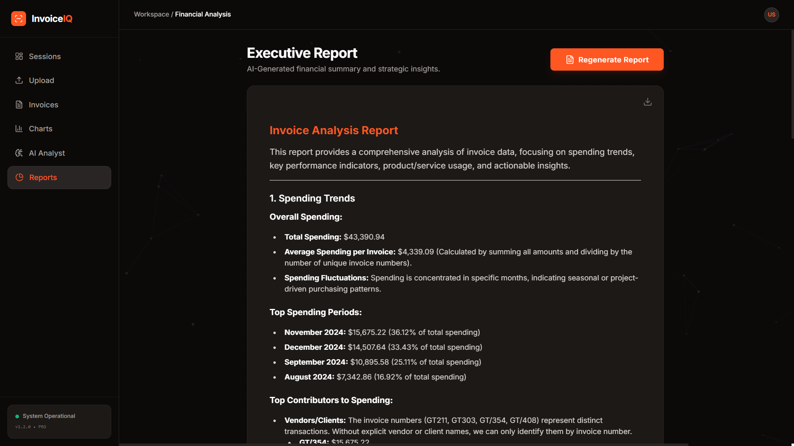

# 🚀 **InvoiceIQ** - *Next-Gen AI Financial Analyst*

[](https://python.org)
[](https://fastapi.tiangolo.com)
[](https://react.dev)
[](https://vitejs.dev)
[](https://deepmind.google/technologies/gemini/)

> **Transform static invoices into actionable financial intelligence.**  
> InvoiceIQ leverages Google's Gemini 2.0 Vision & Language models to extract, analyze, and visualize data from invoices instantly.

---

## 📸 **Visual Tour**

### 🏠 **Dashboard Home**
The command center for your financial operations. Upload invoices and get immediate status updates.


### 📈 **Interactive Charts**
Visualizations aren't just static images. View comprehensive breakdowns of your data with interactive charts.


### 🤖 **AI Analyst**
Chat with your data! Ask questions like *"Show me monthly sales trends"* or *"Who is my top vendor?"* and get instant answers.


### 📝 **Executive Reports**
Generate detailed markdown reports summarizing spending habits, comparisons, and strategic insights ready for export.


---

## ✨ **Key Features**

*   **⚡ High-Speed Extraction**: Drag & drop multiple invoices (PDF/Image) and extract data in seconds using Gemini 2.0 Flash.
*   **🤖 AI Data Analyst**: A conversational agent that understands your data. Ask comprehensive questions and receive Python-generated visualizations in real-time.
*   **📈 Intelligent Charts**: Visualizations aren't just static images—they are interactive Plotly graphs supporting zoom, pan, and hover details.
*   **📑 Automated Executive Reports**: One-click generation of detailed financial reports highlighting KPIs, anomalies, and spending trends.
*   **🎨 Premium UI/UX**: Built with a "Dark Industrial" aesthetic using TailwindCSS and Framer Motion for a smooth, app-like experience.

---

## 🛠️ **Tech Stack**

### **Backend (Python)**
*   **FastAPI**: High-performance async API framework.
*   **Pandas**: Robust data manipulation and analysis.
*   **Google GenAI SDK**: Direct integration with Gemini models.
*   **Uvicorn**: Lightning-fast ASGI server.

### **Frontend (TypeScript)**
*   **React 18**: Component-based UI architecture.
*   **Vite**: Next-generation frontend tooling.
*   **TailwindCSS**: Utility-first styling for rapid design.
*   **Framer Motion**: Production-ready animation library.
*   **Lucide React**: Beautiful, consistent icons.

---

## 🚀 **Getting Started**

### **Prerequisites**
*   Python 3.9+
*   Node.js 18+
*   Google Cloud API Key (with Gemini access)

### **Installation**

1.  **Clone the Repository**
    ```bash
    git clone https://github.com/YashGondaliya36/Invoice-Analyzer.git
    cd Invoice-Analyzer
    ```

2.  **Backend Setup**
    ```bash
    # Create virtual environment
    python -m venv venv
    venv\Scripts\activate  # Windows
    # source venv/bin/activate # Mac/Linux

    # Install dependencies
    pip install -r requirements.txt

    # Setup Environment
    # Create a .env file in the root directory
    echo "GOOGLE_API_KEY=your_key_here" > .env
    ```

3.  **Frontend Setup**
    ```bash
    cd frontend
    npm install
    ```

### **Running the App**

**Step 1: Start Backend Server**
```bash
# In root directory
python -m uvicorn app.main:app --reload
```

**Step 2: Start Frontend Client**
```bash
# In /frontend directory
npm run dev
```

Open your browser and navigate to `http://localhost:5173` to start analyzing!

---

## 🤝 **Contributing**

Contributions are welcome! Please feel free to submit a Pull Request.

1.  Fork the Project
2.  Create your Feature Branch (`git checkout -b feature/AmazingFeature`)
3.  Commit your Changes (`git commit -m 'Add some AmazingFeature'`)
4.  Push to the Branch (`git push origin feature/AmazingFeature`)
5.  Open a Pull Request

---

## 📬 **Contact**

**Yash Gondaliya** - [LinkedIn](https://www.linkedin.com/in/yash-gondaliya-02427a260)

Project Link: [https://github.com/YashGondaliya36/Invoice-Analyzer](https://github.com/YashGondaliya36/Invoice-Analyzer)